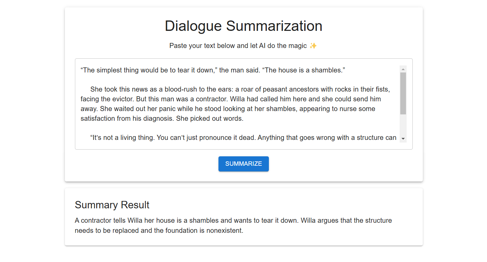

# ✂️ Cut-Your-Text

A simple web application that utilizes a fine-tuned **BERT** model to summarize dialogue, allowing users to extract concise and meaningful summaries from conversations.   

## 📖 Table of Contents
- [📊 Dataset](#-dataset)
- [⚙️ Features](#-features)
- [🛠️ Tech Stack](#-tech-stack)
- [🚀 Installation](#-installation)
- [🤝 Contributing](#-contributing)
- [📃 License](#-license)

## 📊 Dataset

The dataset can be found [here](https://huggingface.co/datasets/knkarthick/dialogsum). This dataset contains more than 13,460 dialogues with corresponding manually labeled summaries and topics.

These conversations cover a wide range of **daily-life scenarios**, including:  
- 🏫 **Schooling**  
- 🏢 **Work**  
- 💊 **Medication**  
- 🛍️ **Shopping**  
- 🏖️ **Leisure & Travel** 

### Dataset Structure

| Field         | Description                                                          |
| ------------- | -------------------------------------------------------------------- |
| dialogue    | text of dialogue                                |
| summary    | human written summary of the dialogue                                       |
| topic    | human written topic/one liner of the dialogue                                    |
| id   | unique file id of an example                                          | 

## ⚙️ Features

**🚀 AI-powered summarization:** Extracts concise and meaningful summaries from long dialogues. 

<p align="center">
  
</p>

## 🛠️ Tech Stack  

This project utilizes the following technologies:

- **Frontend:**  
  - React.js  
  - TypeScript  

- **Backend:**  
  - FastAPI  
  - PyTorch
  - Docker 

## 🚀 Installation

Follow the steps below to run the project locally:

### 1. Clone the Repository  
Start by cloning the repository to your local machine:

```bash
git clone https://github.com/PhamAnhTienn/Cut-Your-Text.git
cd Cut-Your-Text
```

### 2. Build and Start the Docker Containers
Use Docker Compose to build and run the project:

```bash
docker-compose up --build
```

### 3. Train the Model (Optional)
Before making summarizations, ensure the model is trained:

```bash
http://localhost:8080/train
```

### 4. Access the Application
Once running, you can test the summarization API at:

```bash
http://localhost:8080/summarize
```

## 🤝 Contributing

This project is open to contributions. Please feel free to submit a PR.

## 📃 License

This project is provided under an MIT license. See the [LICENSE](LICENSE) file for details.